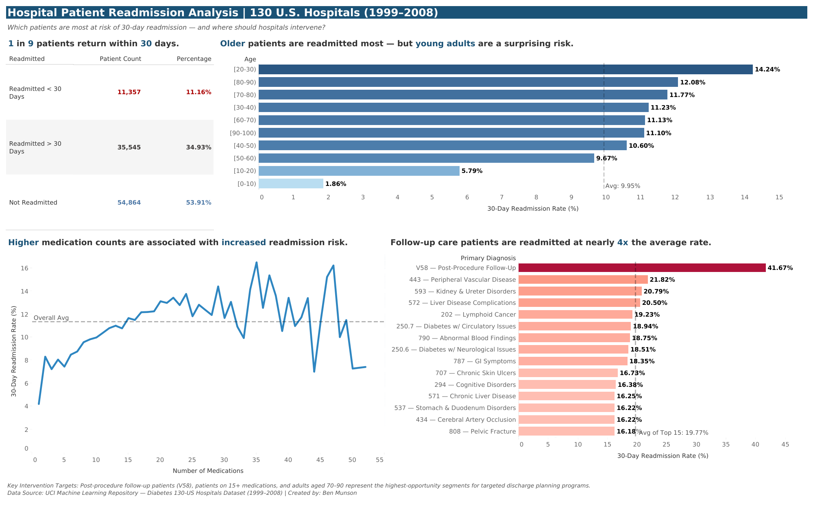

# Hospital Patient Readmission Analysis
**Tools:** SQL (SQLiteStudio) | Tableau  
**Data Source:** [UCI Machine Learning Repository — Diabetes 130-US Hospitals Dataset (1999–2008)](https://archive.ics.uci.edu/dataset/296/diabetes+130-us+hospitals+for+years+1999-2008)  
**Dashboard:** [View Live on Tableau Public](https://public.tableau.com/app/profile/benjamin.munson/viz/HospitalPatientReadmissionAnalysis/ReadmissionAnalysisDashboard)

---

## Project Overview

This project analyzes **101,766 patient records** from 130 U.S. hospitals to identify the key drivers of 30-day hospital readmission rates among diabetic patients. The goal was to surface actionable insights that could help healthcare organizations identify high-risk patients and reduce avoidable readmissions.

The analysis covers three primary areas of investigation:
- The overall 30-day readmission rate across the patient population
- The relationship between patient age, medication count, and readmission risk
- Which primary diagnoses are most strongly associated with early readmission

---

## Repository Structure

```
hospital-readmission-analysis/
│
├── README.md
├── queries/
│   └── readmission_analysis.sql
├── data/
│   ├── overall_readmission_rate.csv
│   ├── readmission_by_age.csv
│   ├── impact_of_num_of_medications.csv
│   ├── readmission_by_primary_diagnosis.csv
│   └── high_risk_patients.csv
└── dashboard/
    └── Readmission_Analysis_Dashboard.png
```

---

## Key Findings

### 1. Overall Readmission Rate
- **11.16%** of patients were readmitted within 30 days
- **34.93%** were readmitted after 30 days
- **53.91%** were not readmitted

### 2. Readmission by Age Group
- Patients aged **20-30** had the highest 30-day readmission rate at **14.24%**
- Patients aged **70-90** consistently exceeded the **9.95% average**, representing a large and vulnerable population
- Pediatric patients (0-10) had the lowest rate at **1.86%**

### 3. Effect of Medication Count
- A clear upward trend exists between medication count and readmission risk among patients prescribed **1 to 42 medications**
- Patients on higher medication counts are more likely to be readmitted within 30 days, suggesting medication complexity as a meaningful risk indicator
- *Note: Medication counts with fewer than 50 patients were excluded to ensure statistical reliability*

### 4. Top Diagnoses by Readmission Rate
- **V58 — Post-Procedure Follow-Up** had the highest readmission rate at **41.67%** — nearly 4x the overall average
- **443 — Peripheral Vascular Disease (21.82%)** and **593 — Kidney & Ureter Disorders (20.79%)** followed as the next highest risk diagnoses
- Both diabetic complication codes **(250.6 and 250.7)** appeared in the top 10, reinforcing the clinical relevance of this dataset
- *Note: Only diagnoses with 100 or more patients were included to ensure statistical significance*

---

## Recommendations

Based on the analysis, the following interventions are recommended for healthcare organizations looking to reduce 30-day readmission rates:

1. **Target post-procedure follow-up patients (V58)** with enhanced discharge planning and post-discharge check-in programs, given their dramatically elevated readmission rate of 41.67%
2. **Implement medication reconciliation programs** for patients prescribed 15 or more medications, as this group shows consistently elevated readmission risk
3. **Prioritize elderly patients aged 70-90** for post-discharge support, as they represent both a high-volume and above-average-risk population
4. **Focus resources on vascular, kidney, and liver disease patients**, as these diagnoses cluster in the top readmission risk categories beyond diabetic complications

---

## SQL Methodology

Five queries were written to extract insights from the raw dataset. All queries were written and executed in **SQLiteStudio**. See [`queries/readmission_analysis.sql`](queries/readmission_analysis.sql) for the full query file.

| Query | Purpose |
|---|---|
| Query 1 | Overall readmission rate breakdown |
| Query 2 | Readmission rate segmented by age group |
| Query 3 | Impact of medication count on readmission rate |
| Query 4 | Top 15 diagnoses by 30-day readmission rate |
| Query 5 | High risk patient profile combining multiple risk factors |

---

## Dashboard Preview



---

## About

**Ben Munson**  
Healthcare & Data Analyst | Excel • SQL • Tableau  
[LinkedIn Profile](https://www.linkedin.com/in/munsonben/) | [Tableau Public](https://public.tableau.com/app/profile/benjamin.munson/vizzes)
